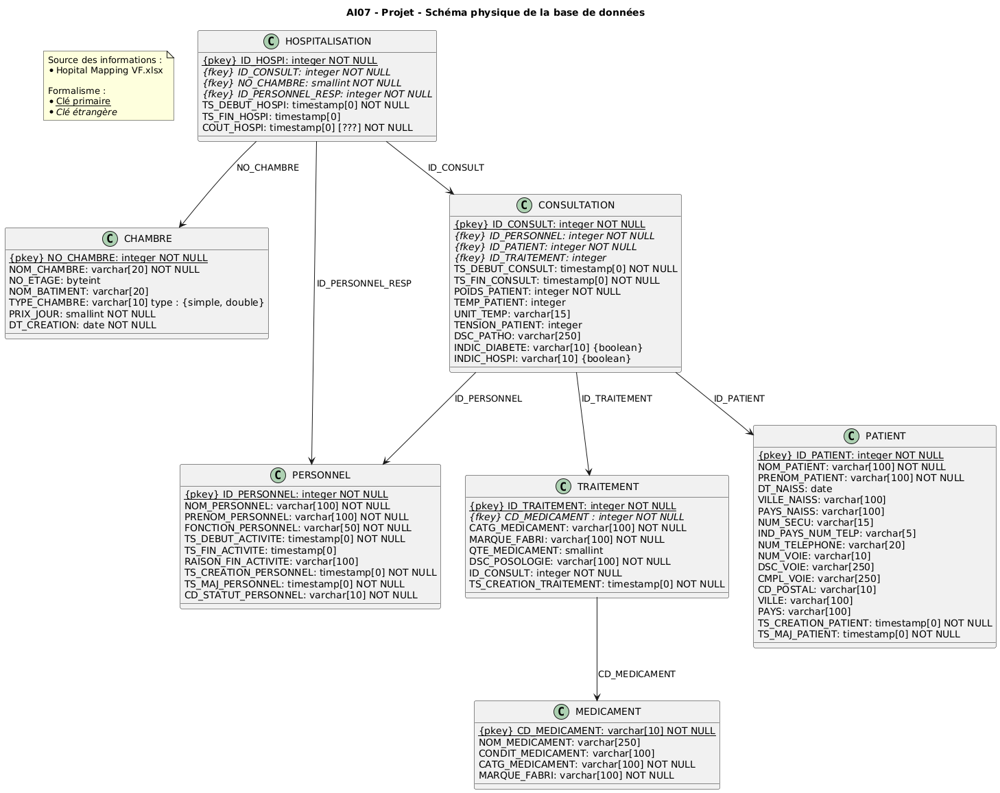
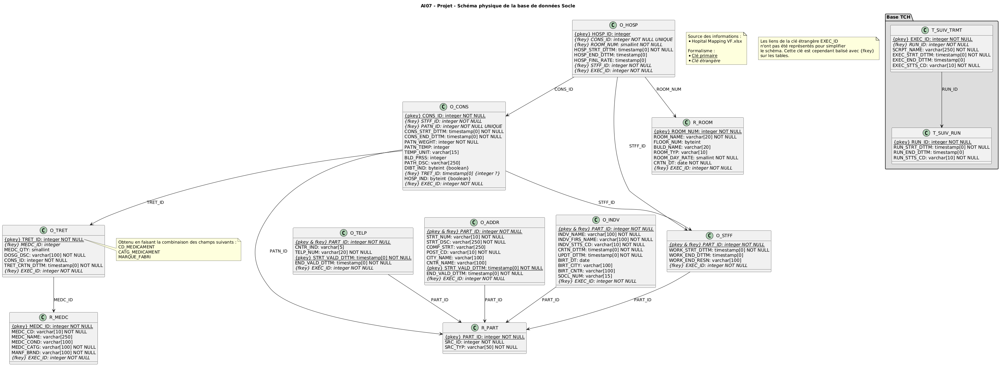

# 🌐 Projet AI07 - Groupe 4

| Membres du groupe          |
|:--------------------------:|
| **Quentin Valakou** (référent) |
| Rayane Galleze             |
| Lucas Doublet              |
| Julien Pillis              |
| Alexandre Bidaux           |
| Julie Chartier             |

---

## 📦 Rendu Lot 1 : Installation de l’environnement de travail et conception de la solution

---

### 1. ⚙️ Environnement technique mis en place

Afin de garantir une bonne organisation, une collaboration efficace et une traçabilité du travail accompli, l’environnement de travail suivant a été mis en place :

#### **Outils de gestion et de collaboration**

- **Suivi de projet** : *Jira*  
Gestion des tâches, Planification des sprints, et suivi de l’avancement et la priorisation des activités.
  
- **Plateforme d’échange au sein de l’équipe projet** : *WhatsApp*  
  Pour une communication rapide et fluide entre l'équipe.

- **Plateforme d’échange avec le client** : *Microsoft Teams*  
  Pour les réunions avec le client, les partages de documents, et la centralisation des échanges officiels.

#### **Outils techniques**

- **Éditeur de texte** : *Visual Studio Code*  
  Choisi pour sa légèreté, sa large palette d’extensions (SQL, Git, Snowflake)

- **Versionnement** : *GitLab*  
  Partage du code, gestion des versions et l’intégration continue. Un dépôt dédié au projet a été créé.

- **Plateforme de données** : *Snowflake*  
  Pour stocker, traiter et analyser les données. C'est le cœur de l’architecture de notre data warehouse.

---

### 2. 🧠 Conception de la solution

L’objectif de cette première phase est de définir l’architecture logique et physique du data warehouse. Cela permet de garantir une modélisation robuste et évolutive de notre socle de données.

#### Travaux réalisés :

##### ✅ Modèle Physique de Données – **Stage**

Ce modèle définit la structure des données niveau STG : les entités, les types de données, les relations et les contraintes d’intégrité.

> 

##### ✅ Modèle Physique de Données – **Socle**

Ce modèle décrit l’ossature principale du data warehouse, avec les dimensions et faits structurant l’ensemble des analyses futures.

> 

---

### ✅ Bilan

L’ensemble des outils nécessaires au bon déroulement du projet ont été mis en place, et la phase de conception technique est bien avancée avec la réalisation des modèles physiques de données.  
On est donc prêt à entamer la phase suivante : **implémentation du data warehouse** sur la plateforme Snowflake, en respectant les modèles définis.

---
